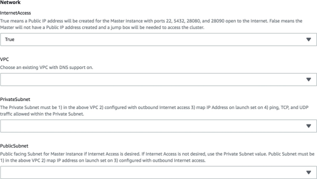
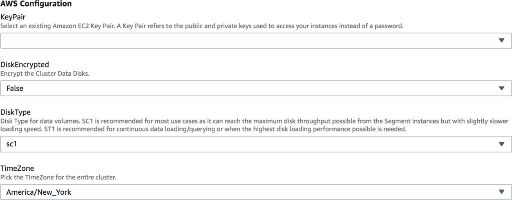
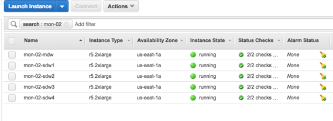

--- 
title: "Greenplum Database Cloud Release Notes for AWS v6.7"
---

VMware Tanzu Greenplum on AWS is available with two different deployment templates. 

One template creates all resources needed for your VMware Tanzu Greenplum cluster, including the Virtual Private Cloud and subnet. The other template uses an existing VPC and subnet.

NOTE: CloudFormation template version 6.7 is based on:
-   [VMware Tanzu Greenplum Database version 6.19.0](https://gpdb.docs.pivotal.io/5290/relnotes/gpdb-5292-release-notes.html) or 
-   [VMware Tanzu Greenplum Database version 5.29.2](https://gpdb.docs.pivotal.io/5290/relnotes/gpdb-5294-release-notes.html) or
-   [VMware Tanzu Greenplum Database version 4.3.33](https://gpdb.docs.pivotal.io/archive/index.html#4333)

## <a id="tools-features"></a>Cloud Native and Cloud Managed Tools and Features

|Utility/Feature | Description |
|------|---------------|
|bouncer|Command line utility that simplifies using pgBouncer connection pooler.|
|gpcompute|Grow or shrink compute independently of storage. Additionally, migrate segment hosts seamlessly to R5b series instance type from R5 series instance type (or) vice versa.|
|gpgrow|Grow storage independently of compute.
|gpmaintain/gpcronmaintain|Automates routine maintenance of VMware Tanzu Greenplum such as vacuum and analyzing tables.|
|gpoptional|Installation tool for installing optional components such as MADlib and Command Center.|
|gppower|Automates the Pausing and Resuming a cluster to save on infrastructure costs.|
|gprelease/gpcronrelease|Automates the upgrade of VMware Tanzu Greenplum, any optional components installed, and the cloud utilities.|
|gpsnap/gpcronsnap|Automates the execution of snapshot backups and restores using the cloud vendor's native snapshot utilities.|
|Self-healing|Automatic instance replacement and recovery in a failure event.|

## <a id="licensing"></a>Licensing

Greenplum on AWS BYOL is licensed by the number of cores deployed, and it is important to note that in AWS, **2 vCPUs equal 1 core** because of hyper-threading. Customers will total the number of vCPUs deployed in the cluster, divide by 2, and then purchase that many subscription cores from VMware Tanzu.

## <a id="calculating storage"></a>Calculating Usable Storage

To determine the storage size of the deployment, multiply the number of segment instances in the cluster times the number of disks per instance, and times the size of each disk chosen to get the raw storage. Divide the raw storage by two because of mirroring and then multiply this by .7 to leave space for transaction and temp files.

Example:
( 16 Segment Instances * 3 Disks * 2TB Disks ) = 96 TB Raw Storage ( 96 / 2 ) * .7 = 33.6 TB Usable Storage 

# <a id="deploying"></a>Deploying Greenplum on AWS

VMware Tanzu Greenplum on AWS can be deployed with one of two different Cloud Formation Templates. One template creates all resources needed for deployment, while the other relies on using an existing VPC. These differences are in the Network section of the two templates, with everything else remaining the same.

## <a id="stack name"></a>Stack Name
This identifies the VMware Tanzu Greenplum Stack. Stack is an AWS term which basically means cluster, making it easier to manage all of the resources used in the deployment.


## <a id="network"></a>Network
The network section differs between deploying to a new VPC or deploying to an existing VPC.

### <a id="internet access"></a>Internet Access
This parameter is available for both templates. "True" means a Public IP address will be created for the Master Instance with ports 22, 5432, 28080, and 28090 open to the Internet. "False" means the Master will not have a Public IP address created, and a jump box will be needed to access the cluster.

### <a id="new vpc cluster"></a>New VPC Cluster


#### <a id="availability zone"></a>Availability Zone
An Availability Zone is an isolated area within a geographic tegion. It is analogous to a physical data center.

### <a id="vpc mask"></a>VPC Mask
VPC CIDR Mask specifies the range of IPv4 addresses for a new VPC for Greenplum. AWS allows 10.0.0.0 - 10.255.255.255 (10/8 prefix), 172.16.0.0 - 172.31.255.255 (172.16/12 prefix), and 192.168.0.0 - 192.168.255.255 (192.168/16 prefix). It is recommended to use /16 for the VPC.

### <a id="private subnet mask"></a>Private Subnet Mask
Private Subnet CIDR Mask used in the VPC by VMware Tanzu Greenplum. This must be a subset of the VPC block, and cannot overlap with the Public Subnet Mask. It is recommended to use /24 for the Private Subnet.

### <a id="public subnet mask"></a>Public Subnet Mask
Public Subnet CIDR Mask used in the VPC by VMware Tanzu Greenplum. This must be a subset of the VPC block, and cannot overlap with the Private Subnet Mask. It is recommended to use /24 for the Public Subnet. 

Note: A Public Subnet is required for the NAT Gateway as well as a deployment with a Public IP address assigned to the Master.

### <a id="existing VPC cluster"></a>Existing VPC Cluster



### <a id="VPC"></a>VPC

Choose an existing VPC to deploy your cluster. The VPC must have DNS support on.

### <a id="private subnet"></a>Private Subnet

The Private Subnet must be 1) in the above VPC 2) configured with outbound Internet access 3) map IP Address on launch set on 4) ping, TCP, and UDP traffic allowed within the Private Subnet.

### <a id="public subnet"></a>Public Subnet

Public facing subnet for master instance if internet access is desired. If not, use the private subnet value. Public Subnet must be 1) in the above VPC 2) map IP address on launch set on 3) configured with outbound internet access.

## <a id="aws configuration"></a>AWS Configuration



### <a id="key pair"></a>Key Pair

This is the name of your AWS private key. It is used to ssh to the master instance after the stack is created.

### <a id="disk encrypted"></a>Disk Encrypted

Specifies to use AWS EBS disk encryption for the data disks. The swap disk will also be encrypted.

### <a id="disk type"></a>Disk Type

Specify the disk type for the data volumes in your cluster. SC1 is recommended for most use cases as it can reach the maximum disk throughput possible from the Segment instances. ST1 is recommended for continuous data loading/querying or when the highest disk loading performance possible is needed. SC1 disks are significantly less expensive than ST1.

Tip: You can leverage the `gpsnap` utility to change the disk type after your deployment has been completed. This is done by creating a snapshot with `gpsnap`, then restoring that snapshot using a different disk type.

### <a id="time zone"></a>Time Zone

Pick the time zone you wish to use for the virtual machines in your cluster.

## <a id="greenplum configuration"></a>Greenplum Configuration


### <a id="database version"></a>Database Version

Pick the major database version you wish to use. GP4, GP5 and GP6 are currently available with this release.

### <a id="database name"></a>Database Name

This defines the default database name for your Greenplum cluster. Optional components will be installed in this database.

## <a id="master instance"></a>Master Instance


### <a id="master instance type"></a>Master Instance Type

Specifies the instance type for the master instance. The r5.xlarge instance type is recommended for multi-instance deployments.

### <a id="master disk size"></a>Master Disk Size

Specifies the size in GB for the data disks on the Master Instance. For multi-instance deployments, the master will only have one disk.

## <a id="segment instances"></a>Segment Instances


### <a id="segment instance type"></a>Segment Instance Type

Amazon supports many different instance types, but this has been limited to three different types. The r5.2xlarge is recommended for single-user clusters, r5.4xlarge for a great balance of single- user performance and moderate concurrency, and r5.8xlarge for high concurrency needs. 

Note: This parameter is ignored for Single-Instance deployments.

Tip: You can leverage the `gpcompute` utility to change the instance type after your deployment has been completed.

### <a id="segment disk size"></a>Segment Disk Size

Size in GB for each EBS volume. There are 3 EBS volumes per each segment instance.

### <a id="segment instance count"></a>Segment Instance Count

Choose the number of segment instances in your deployment. The more instances you deploy, the better the performance. Choose 0 to deploy a single-instance cluster.

Tip: If deploying a single-instance cluster, some cloud utilities will not work fully.-   `gpcompute` will not change the size of the master instance
-   `gppower` will not pause the master instance
-   `gpgrow` will not grow the master instance

## <a id="master instance"></a>AWS CloudFormation

Deployment is very simple in the AWS Marketplace. Simply provide the parameters in the user interface and submit the CloudFormation template to create the stack.

### <a id="create in progress"></a>Create In Progress

During the stack deployment, CloudFormation will indicate that the stack is being created with CREATE_IN_PROGRESS status.

### <a id="create complete"></a>Create Complete

During the stack deployment, CloudFormation will indicate that the stack is being created with CREATE_IN_PROGRESS status.

### <a id="EC2 instances"></a>EC2 Instances

Each instance contains a suffix in the name to indicate the role of mdw (master) or sdwn (segment) as shown below.



### <a id="CloudFormation output"></a>Cloud Formation Output

The Outputs tab of the CloudFormation stack will have the connection information to the database once the stack reaches the CREATE_COMPLETE Status.

As shown below, the Output section will contain all of the information needed to start using your stack. Note that the password shown below is randomly generated and not stored by VMware Tanzu.


## <a id="security"></a>Security

The randomly-generated password can be changed for `gpmon` and `gpadmin`. It is recommended to keep these passwords in sync too. This is done inside a database session as shown below.

```
ALTER USER gpadmin PASSWORD '<new_password>'; 
ALTER USER gpmon PASSWORD '<new_password>'
```

After updating the database passwords, you need to update configuration files.

1.	/home/gpadmin/.pgpass
        The format for this file is as follows:

```
localhost:5432:pgbouncer:gpadmin:<new password> 
mdw:6432:*:gpadmin:<new password>
*:6432:gpperfmon:gpmon:<new password>
```

2.	/opt/pivotal/greenplum/variables.sh
        Find the GPADMIN_PASSWORD variable and update the value set as follows:

```
GPADMIN_PASSWORD="<new password>"
```

3.	/data1/master/pgbouncer/userlist.txt
        Use the encrypted value for the password from pg_shadow for the `gpadmin` user.

```
psql -t -A -c "SELECT passwd FROM pg_shadow \ 
WHERE usename = 'gpadmin'"
```

The encrypted value will begin with "md" and use this in the file with the following format:

```
"gpadmin" "<encrypted password>" 
```

The reason for storing the password in /opt/pivotal/variables.sh is to make a snapshot backup restore work properly. If you take a backup of your cluster and restore it to another cluster, the password stored inside the database is unlikely to match the pgBouncer and the .pgpass configuration. In another scenario, you might take a snapshot of the database, update the database password, then restore your snapshot -- which again causes a conflict of configuration files not matching the database.

During a snapshot restore, the `gpsnap` utility uses the password stored in
/opt/pivotal/greenplum/variables.sh to set the database passwords for `gpmon` and `gpadmin`, and update the pgBouncer and .pgpass configuration files. This ensures that a snapshot restore will work properly.

## <a id="connecting"></a>Connecting

Connecting can be done with the web-based GP Browser database client, ssh, or with an external database client tool like pgAdmin 4. The deployment output for master instance, port, admin username, and password used to connect to Greenplum. Note that the password in the output is the database password for user `gpadmin`, and not the password for ssh.

### <a id="phpPgAdmin"></a>phpPgAdmin

This is a VMware Tanzu enhanced version of the popular phpPgAdmin web-based SQL tool. It has been configured to start automatically on the master instance. The URL is provided in the deployment output. Connection is done by simply using the admin `gpadmin` user and the provided database password.


Tip:  phpPgAdmin uses Apache HTTP server and does not include an SSL certificate. If you plan on using this tool across the internet, it is highly recommended that you configure Apache with an SSL certificate.

### <a id="ssh access"></a>SSH Access

Use the SSH KeyName provided when creating the stack to connect with ssh and use the AdminUserName. For example:

```
ssh -i my_private_key.pem gpadmin@34.196.112.102
```

Once connected via ssh, the message of the day provides detailed information about the stack as shown below.


### <a id="client tool"></a>Client Tool

Connecting with a remote client utility like pgAdmin 4 or DBeaver is also very easy to do using the Master public IP address and password provided in the CloudFormation Output. Connect as the AdminUserName (gpadmin) and use the provided password found in the CloudFormation Output.


## <a id="additional resources"></a>Additional Resources

Installation of VMware Tanzu Greenplum on AWS includes detailed logs plus supplemental installs and validation scripts that can be executed after the initial installation is complete.

### <a id="aws logs"></a>AWS Logs

Logs for the deployment of the Stack can be found in /opt/pivotal/greenplum/rollout.log. A log file is on every instance, but the master instance will have more detailed information regarding the database initialization.

### <a id="validation"></a>Validation

Validation includes scripts to run industry standard benchmarks of TPC-H and TPC-DS. It also includes scripts to validate the disk and network performance of the cluster using the VMware Tanzu Greenplum utility "gpcheckperf".

TPC tests should be executed as root on the master instance. Use the "sudo bash" command to start a session as root, then navigate to /opt/pivotal/greenplum/validation/tpc-ds or
/opt/pivotal/greenplum/validation/tpc-h and run the "run_once.sh" script, then follow the directions.

The performance scripts should be run with the database stopped. (`gpstop -a`) and can be run as `gpadmin`. This is located in /opt/pivotal/greenplum/validation/performance.

# <a id="gp on aws additional features"></a>Greenplum on AWS Additional Features

## <a id="bouncer"></a>bouncer

pgBouncer is a load balancing utility that is included with Greenplum. This utility allows far greater connections to the database with less impact on resources. It is recommended to use pgBouncer instead of connecting directly to the database. More information on pgBouncer is available in the Greenplum documentation.

The bouncer utility automates the starting, stopping, pausing, and resuming of pgBouncer. It is recommended to use this utility to manage pgBouncer on your cluster.

pgBouncer is configured to listen on port 5432 -- the default port that is usually used by Greenplum. Greenplum has been configured to listen on port 6432.

Authentication has been configured to use "md5", which is an encrypted password. Create users and assign passwords in Greenplum as usual, and pgBouncer will authenticate users with the database passwords you set.

Pooling has been configured for "transaction" with max client connections of 1000 and max database connections to 10. These settings can be changed, but the defaults provide a good starting point for most installations.

Configuration and logs for pgBouncer are located in /data1/master/pgbouncer on the master instance.

Note that for JDBC connections, you may need to add "search_path" to the ignore_startup_parameters configuration, and also "prepareThreshold=0" to your JDBC URL.

Connections can optionally be made with SSL to secure connections from your client to the database. Actions available with bouncer include start, stop, pause, and resume.

bouncer <action>

It is not recommended to disable pgBouncer in your AWS cluster. Several tools and features rely on pgBouncer. You can still connect to the database directly with port 6432. If this is desired, you may need to update the AWS Security Group to allow access to port 6432.

## <a id="gpcompute"></a>gpcompute

The "gpcompute" utility enables you to add or reduce the compute capacity of your cluster independent of your storage. The command completely automates and integrates with AWS to change the instance type of the segment instances.

The status command will show you the current instance type of your segment instances and show the instance type of the current launch template.

```
gpcompute status
```

The command will accept these six different instance types in AWS: r5.2xlarge, r5.4xlarge, r5.8xlarge, r5b.2xlarge, r5b.4xlarge and r5b.8xlarge. This command facilitates seamless migration of segment hosts from R5 series instance type to R5b series instance type, or vice versa.

```
gpcompute <instance_type>
```

2xlarge is ideal for single-user workloads. 4xlarge provides improved single-user performance and increased concurrency performance. Lastly, 8xlarge will provide nearly the same single-user performance, but an increase in concurrency performance. 

## <a id="gpgrow"></a>gpgrow

Increase the segment instances' disk size in your cluster completely online with this utility. Segment instances have three data disks each and the data size is specified in GB. AWS only allows increasing a disk size and can only be modified once every six hours. This is an online activity, so the database does not need to be stopped. The --master-only switch allows you to alter the disk size of the Master node.

gpgrow <new disk size>


 
gpgrow <new disk size> --master-only

## <a id="gpmaintain./gpcronmaintain"></a>gpmaintain/gpcronmaintain

## <a id="gpoptional"></a>gpoptional

## <a id="gppower"></a>gppower

## <a id="gprelease/gpcronrelease"></a>gprelease/gpcronrelease

## <a id="gpsnap/gpcronsnap"></a>gpsnap/gpcronsnap

## <a id="self-healing"></a>Self Healing

### <a id="segment healing"></a>Segment Healing

### <a id="standby-master healing"></a>Standby-Master Healing

### <a id="master healing"></a>Master Healing

## <a id="pxf extension framework"></a>The PXF Extension Framework (PXF)}

## <a id="linux information"></a>Linux Information

### <a id="patching"></a>Patching

### <a id="core dumps"></a>Core Dumps

## <a id="gp on aws tech details history"></a>Greenplum in AWS Technical Details and History

### <a id="aws resources"></a>AWS Resources

#### <a id="ami"></a>AMI

#### <a id="availability zone"></a>Availability Zone

#### <a id="vpc"></a>VPC

#### <a id="ami"></a>Subnet

#### <a id="vpc"></a>Security Group

#### <a id="vpc"></a>Internet Gateway

#### <a id="ami"></a>NAI Gateway

#### <a id="vpc"></a>Route

#### <a id="vpc"></a>Autoscaling Group

#### <a id="ami"></a>Elastic IP

#### <a id="vpc"></a>Storage

#### <a id="vpc"></a>Systems Manager Parameter Store (SSM)

#### <a id="ami"></a>IAM permissions

#### <a id="vpc"></a>Diagram

### <a id="vpc"></a>Version History

#### <a id="ami"></a>GPDB Version Update

#### <a id="vpc"></a>Version 6.7

#### <a id="vpc"></a>Version 6.6

#### <a id="ami"></a>Version 6.5

#### <a id="vpc"></a>Version 6.4

#### <a id="vpc"></a>Version 6.3

#### <a id="ami"></a>Version 6.2

#### <a id="vpc"></a>Version 6.1

#### <a id="ami"></a>Version 6.0

#### <a id="vpc"></a>Version 5.1

#### <a id="vpc"></a>Version 5.0

#### <a id="ami"></a>Version 4.3

#### <a id="vpc"></a>Version 4.2

#### <a id="vpc"></a>Version 4.1

#### <a id="ami"></a>Version 4.0

#### <a id="vpc"></a>Version 3.2

#### <a id="ami"></a>Version 3.1

#### <a id="vpc"></a>Version 3.0

#### <a id="vpc"></a>Version 2.4

#### <a id="ami"></a>Version 2.3.1

#### <a id="vpc"></a>Version 2.3

#### <a id="vpc"></a>Version 2.2

#### <a id="ami"></a>Version 2.1

#### <a id="vpc"></a>Version 2.0

#### <a id="ami"></a>Version 1.3

#### <a id="vpc"></a>Version 1.2

#### <a id="vpc"></a>Version 1.1

#### <a id="ami"></a>Version 1.0

# <a id="deploying gp on aws"></a>Deploying Greenplum on AWS

## <a id="vpc"></a>Stack 

#### <a id="ami"></a>AMI

#### <a id="vpc"></a>VPC

